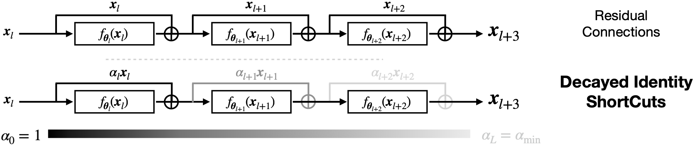

# Residual Connections Harm Self-Supervised Abstract Feature Learning (CVPR 2026)


This is the official code repository for the paper:
> [Residual Connections Harm Generative Representation Learning](https://arxiv.org/abs/2404.10947)
> 
> [Xiao Zhang*](https://xiao7199.github.io/), [Ruoxi Jiang*](https://roxie62.github.io/), [Will Gao](http://www.computerscience.uchicago.edu/people/will-gao/), [Rebecca Willett](https://willett.psd.uchicago.edu/), [Michael Maire](https://computerscience.uchicago.edu/people/michael-maire/)


This codebase provides the implementation of our proposed decayed residual connections designed to enhance generative representation learning. Our implementation builds upon the open-source codebases of Masked Autoencoders ([MAE](https://arxiv.org/abs/2111.06377), [Github](https://github.com/facebookresearch/mae)) and Diffusion models ([SiT](https://arxiv.org/abs/2401.08740), [Github](https://github.com/willisma/SiT)). We appreciate the authors for making their code available to the community.

## Approach Overview

      Our *decayed identity shortcuts* introduce a depth-dependent scaling factor to shortcuts in a residual
      network, thereby modulating the contribution of preceding layers and fostering greater abstraction in deeper
      layers.  A simple schema for controlling decay factor $\alpha$ suffices to improve feature learning in both
      MAEs and diffusion models, as well as diffusion model generation quality.

## Code:
Please refer to the README files in the MAE and SiT folders for instructions on how to reproduce the experiments for masked autoencoders and diffusion models, respectively.


<a name="Citation"></a>
## Citation

```bibtex
@InProceedings{Zhang_2026_CVPR,
    author    = {Zhang, Xiao and Jiang, Ruoxi and Gao, William and Willet, Rebecca and Maire, Michael},
    title     = {Residual Connections Harm Generative Representation Learning},
    booktitle = {Proceedings of the IEEE/CVF Conference on Computer Vision and Pattern Recognition (CVPR)},
    month     = {June},
    year      = {2026},
    pages     = {39669-39679}
}
```
